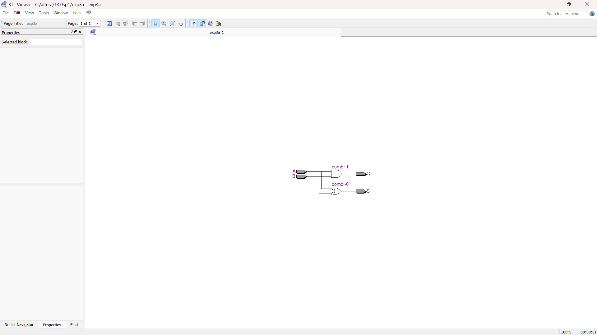
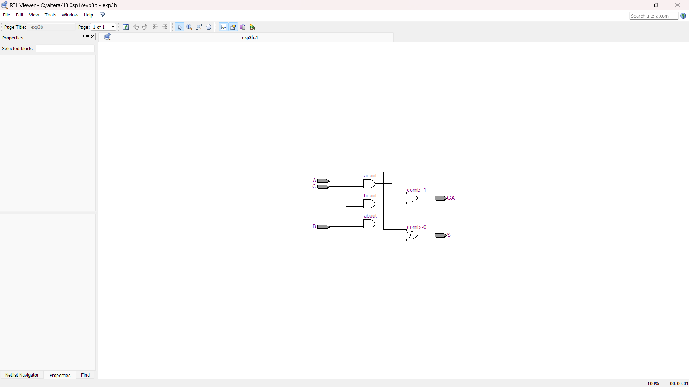
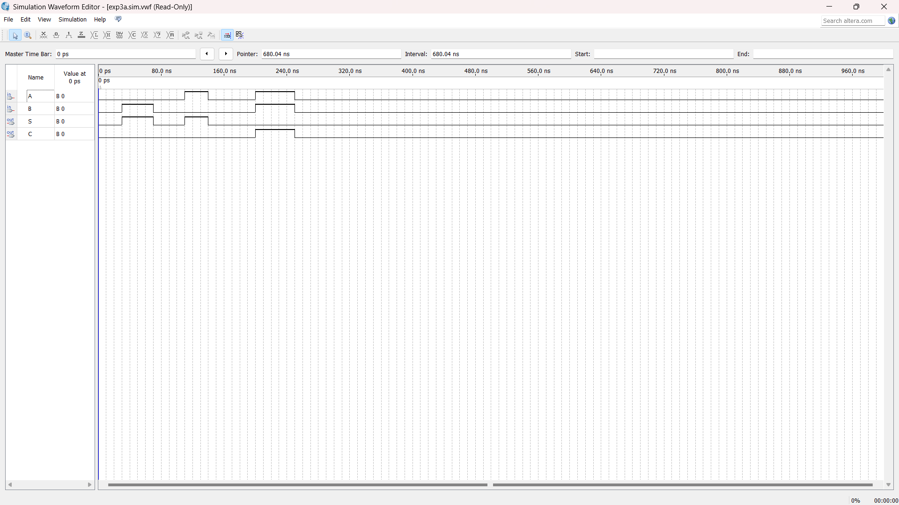
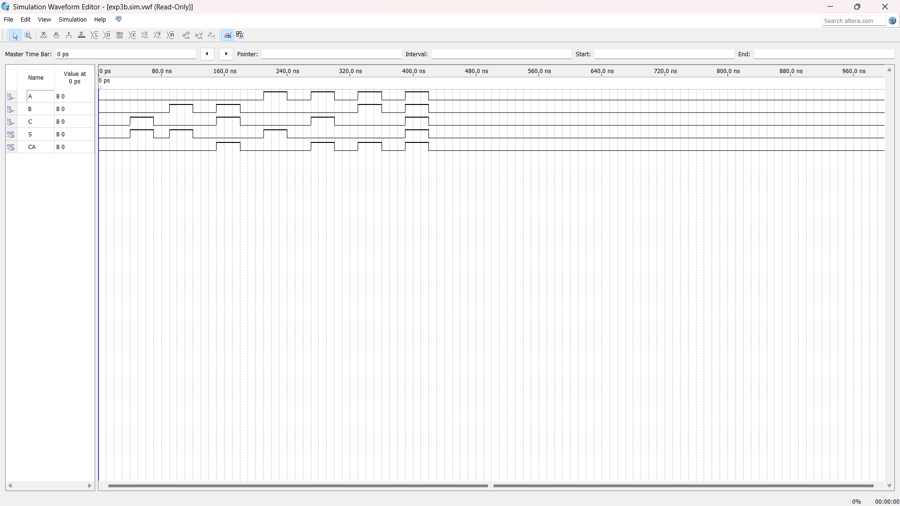

### Ex. No. 3
### Date:8.4.23
# Implementation of half adder and full adder circuit using Verilog HDL
## Aim :
To design and implement half adder and full adder circuit using Verilog HDL and verify its truth table.
## Components Required:
1.	Laptop with Quartus software and modelsim software.
## Theory:
Adders are digital circuits that carry out addition of numbers.
### 1.	Half Adder
Half adder is a combinational circuit that performs simple addition of two binary numbers. The input variables designate the augend and addend bits; the output variables produce the sum and carry. It is necessary to specify two output variables because the result may consist of two binary digits.
#### Truth table
 

Sum = A’B+AB’ = A  
     B
Carry=AB
#### Logic Diagram
 

### 2.	Full Adder
Full adder is a digital circuit used to calculate the sum of three binary bits. It consists of three inputs and two outputs. Two of the input variables, denoted by A and B, represent the two significant bits to be added. The third input, Cin, represents the carry from the previous lower significant position. Two outputs are necessary because the arithmetic sum of three binary digits ranges in value from 0 to 3, and binary 2 or 3 needs two digits. The two outputs are sum and carry. 
#### Truth table
  .

#### K-map Simplification
 

Sum =A’B’Cin+A’BCin’+ABCin+AB’Cin’=A 
 B 
 Cin
Carry = AB + ACin+BCin
#### Logic Diagram
 

## Procedure:
1.	Type the program in Quartus software.
2.	Compile and run the program.
3.	Generate the RTL schematic and save the logic diagram.
4.	Create nodes for inputs and outputs to generate the timing diagram.
5.	For different input combinations, generate the timing diagram.


## Program:
### 1. HALF ADDER:
```
module exp3a(A,B,S,C);
input A,B;
output S,C;
xor(S,A,B);
and(C,A,B);
endmodule
```
### 2. FULL ADDER:
```
module exp3b(A,B,C,S,CA);
input A,B,C;
output S,CA;
wire bc,acout,bcout,about,baout;
xor(bc,B,C);
xor(S,A,bc);
and(acout,A,C);
and(about,A,B);
and(bcout,B,C);
or(baout,bcout,about);
or(CA,acout,baout);
endmodule
```

## RTL Schematic:
### HALF ADDER:


### FULL ADDER:



## Timing Diagram:
### HALF ADDER:


### FULL ADDER:



## Result:
Thus the half adder and full adder circuits are designed and implemented and the truth tables are verified.
